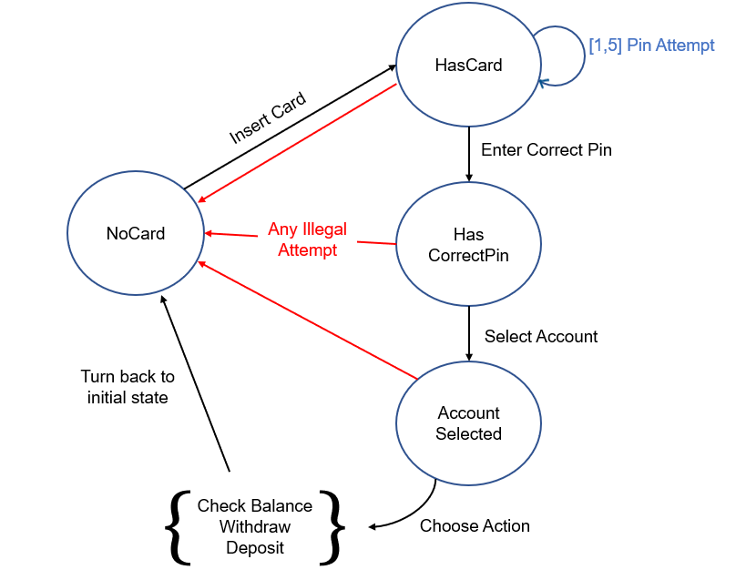

# ATM Controller

simple ATM Controller

## Introduction

- Choose Java rather than Javascript for handling multiple heavy tasks without causing server crash.
- Implemented ATM Controller with State Design Pattern for flexible and resuable software structure.
- Utilized nested class for strong encapsulation

## Cloning the Repository

1.  Navigate to the directory that you would like to clone the repository, and clone with following command:

- `git clone https://github.com/lomuto/atm-controller.git`

2. Check the contents of the remote repository on your machine by following command:

- `cd atm-controller && ls -a`

## Build and run test

First, navigate to the directory where you have cloned the remore repository.

Build and run tests with following commands

- Build  
  `mvn compile`

- Test  
  `mvn test`
